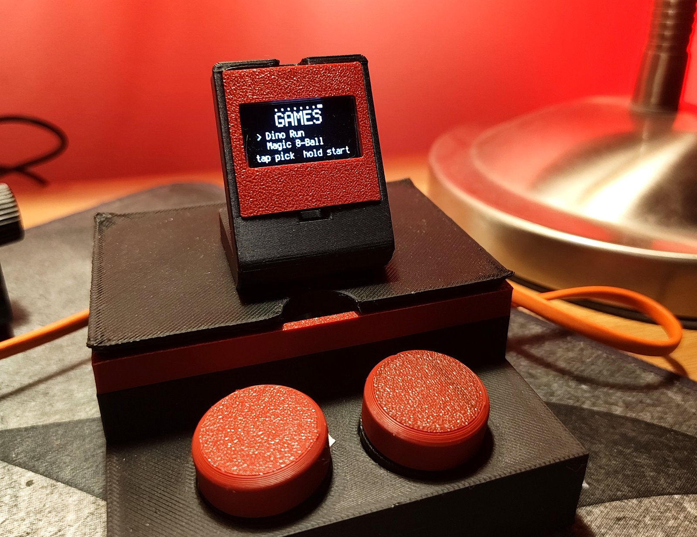

<p align="center">
  
</p>

<p align="center">
  A desk buddy that looks back.<br>
  A Raspberry Pi Pico W, a 128&times;64 OLED and two buttons.
</p>

<p align="center">
  
  
  
  
</p>

<p align="center">
  <a href="https://DimAnge.github.io/mimic/"><b>Try the interface in your browser &rarr;</b></a>
</p>

---

Mimic sits next to the keyboard and keeps an eye on things. It knows the weather,
what is playing, how long until the next meeting, how hard the PC is working, and
how much of the Claude usage window is left — and it pulls a face about all of it.


<p align="center">
  
</p>

<p align="center">
  
</p>

<p align="center">
  <sub>Screens are real frames, not mockups. Most were dumped over USB by
  <code>screenshot.py</code>; the weather, usage and games panels were recovered
  from close-up photographs and thresholded back to two colours.</sub>
</p>

## Why this exists

Mimic started as a private project with two goals: learn electronics properly by
building something that has to work every day, and write Python outside the
analysis scripts I write for work — event loops, hardware constraints, a small
HTTP service, and code that has to survive being unplugged.

It is a learning project, not a product. Some of it is solved the long way round
because the long way round was the point. If you are building your own, the
troubleshooting section below is where most of the learning ended up.

## Contents

- [Why this exists](#why-this-exists)
- [The screens](#the-screens)
- [Controls](#controls)
- [Bill of materials](#bill-of-materials)
- [Wiring](#wiring)
- [Getting it running](#getting-it-running)
- [Configuration](#configuration)
- [How it starts](#how-it-starts)
- [The bridge](#the-bridge)
- [The case](#the-case)
- [Repository layout](#repository-layout)
- [Troubleshooting](#troubleshooting)
- [Roadmap](#roadmap)
- [License](#license)

## The screens

Button 1 walks through the tabs and jumps home when held. Button 2 does whatever
the current tab needs.

| Tab | What it shows | Button 2 |
| --- | --- | --- |
| `FACE` | Animated eyes, a clock, the date, and a note icon while music plays | Cycles the seven moods by hand, for 20 seconds |
| `WEATHER` | A clock big enough to read across the room, temperature and conditions | — |
| `CALENDAR` | The next three events from a private iCal feed | Pages through them |
| `SPOTIFY` | Track, artist and progress, via the Spotify Web API | Tap plays or pauses, hold skips |
| `SYSTEM` | CPU, memory, disk, temperature and uptime of the PC beside it — and the Pico's own IP when the bridge is unreachable | — |
| `TIMER` | Countdown with eight presets from 5 to 60 minutes | Tap starts or stops, hold cycles the preset |
| `USAGE` | Session and weekly Claude usage, with both reset countdowns | — |
| `GAMES` | A menu holding the dino runner and a magic eight ball | Tap moves the cursor, hold starts the game |

Everything the bridge knows arrives in a single `GET /status`, so one request
feeds the calendar, system, usage and Spotify tabs at once.

The two games live in `dino.py` and `eightball.py` and are imported on first
launch rather than at boot — they are the largest modules in the project, and
CircuitPython compiles every `.py` as it imports it, so deferring them cuts
seconds off startup. Inside a game, button 1 backs out to the menu instead of
changing tab.

## Controls

Two buttons, two gestures. A hold is 0.6 s.

| Where | Button 1 | Button 2 tap | Button 2 hold |
| --- | --- | --- | --- |
| Any tab | Next tab | See the table above | See the table above |
| Any tab, held | Home (FACE) | — | — |
| Games menu | Next tab | Move the cursor | Start the selected game |
| In a game | Back to the menu | Jump / shake | — |
| Meeting popup | — | Dismiss | — |

After 45 seconds without a press it returns to FACE on its own — except on
SPOTIFY while something is playing, which stays put.

### What the face is reacting to

Left alone, the mood is not random. Context decides it, in this order, and the
first match wins:

| Priority | Condition | Mood |
| --- | --- | --- |
| 1 | The timer is running | angry — focused, do not disturb |
| 2 | Claude session usage ≥ 90% | surprised |
| 3 | Night | sleepy |
| 4 | The PC has been up more than 2 days | sleepy — it could use a reboot |
| 5 | Music is playing | happy |
| 6 | The weather is notable | sad or happy |
| 7 | Nothing in particular | neutral |

Pressing button 2 on the FACE tab overrides this for 20 seconds, then context
takes over again.

### Screenshots

The SSD1306 cannot be read back — `fill_row` needs a 16-bit colourspace — so
`screenshot.py` walks `display.root_group` and redraws it into a 1-bit buffer,
then prints it over USB. Press `s` in the serial console to capture whatever is
on screen, and `tools/shot.py` turns the dump into a PNG:

```bash
python3 tools/shot.py --paste /tmp/dumps.txt --bezel \
  --names face,calendar,spotify,system,dino,eightball
```

Most screen images in this README came out of that. Three of them would not sit
still long enough to capture — weather, usage and the games menu — so they were
photographed close up instead and put back through `tools/make_photos.py`, which
finds the glass in the photo, squares it to 128 x 64 and thresholds it back to
two colours. Close enough that you cannot tell which is which above.

A meeting popup interrupts any tab when the next calendar event is close.

Burn-in protection runs underneath all of it: the whole frame shifts by a pixel
every few minutes and brightness drops at night. There is no idle sleep — an
idle timeout was tried and removed, because a desk buddy that blanks itself
while you are sitting right there is just a dark rectangle.

## Bill of materials

| Part | Notes |
| --- | --- |
| Raspberry Pi Pico W | Wi-Fi is 2.4 GHz only |
| SSD1306 OLED, 0.96", I2C | 128&times;64, monochrome — there is no colour anywhere in this project |
| 2 &times; tactile buttons | 6&times;6 mm switches on ~25.4 mm pre-assembled discs |
| Passive buzzer module | Plays arbitrary frequencies, so short melodies work |
| Half-size breadboard | Trim the top rail strip so it drops into the tray |
| Female-to-male Dupont jumpers | Nine connections, no soldering |
| USB cable and a 3D printer | For power, code and the case |

## Wiring

<p align="center">
  
</p>

| Signal | Pico W pin | Breadboard hole | Goes to |
| --- | --- | --- | --- |
| I2C data | `GP0` — pin 1 | 1a | OLED `SDA` |
| I2C clock | `GP1` — pin 2 | 2a | OLED `SCL` |
| Ground | `GND` — pin 38 | 3j | OLED `GND` |
| 3V3 out | `3V3` — pin 36 | 5j | OLED `VCC` |
| Button 1 | `GP2` — pin 4 | 4a | Button 1 leg A |
| Ground | `GND` — pin 3 | 3a | Button 1 leg B |
| Button 2 | `GP3` — pin 5 | 5a | Button 2 leg A |
| Ground | `GND` — pin 8 | 8a | Button 2 leg B |
| Buzzer signal | `GP15` — pin 20 | 20a | Buzzer `SIG` |
| 5V | `VBUS` — pin 40 | 1j | Buzzer `VCC` |
| Ground | `GND` — pin 18 | 18a | Buzzer `GND` |

The Pico straddles the channel of a half-size breadboard, so row *n* on the `a`
side is physical pin *n*, and row *n* on the `j` side is pin *41 − n*. The buzzer
runs from `VBUS` rather than `3V3`; everything else is on the 3V3 rail.

Breadboard positions for this exact build are in
[`hardware/README.md`](hardware/README.md).

Check every connection against the table before powering anything up, and check
again after any work on the case. Most faults on this build were a connector
that had worked loose, not code.

## Getting it running

**1. Flash CircuitPython.** Hold `BOOTSEL` while plugging the Pico W in, then
drop the `.uf2` onto the `RPI-RP2` drive. It reboots as `CIRCUITPY`.

**2. Add the libraries.** From the matching CircuitPython bundle, copy into
`/lib` on `CIRCUITPY`:

```
adafruit_display_text/
adafruit_displayio_ssd1306.mpy
adafruit_connection_manager.mpy
adafruit_requests.mpy
```

**3. Add your settings.** Copy `settings.toml.example` to `settings.toml` on the
board and fill it in. `settings.toml` is gitignored; keep it that way.

```toml
WIFI_SSID         = "your-network"
WIFI_PASSWORD     = "your-password"
BRIDGE_URL        = "http://192.168.1.42:8080/status"
OPENWEATHER_TOKEN = "your-openweather-key"
```

Find the bridge address with `hostname -I | awk '{print $1}'` on the PC.

**4. Deploy.** All seven files, to the root of the drive, not `/lib`:

```bash
cp code.py app.py eyes.py dino.py eightball.py sfx.py icons.py \
   /media/$USER/CIRCUITPY/ && sync
tio /dev/ttyACM0    # watch it boot
```

`code.py` and `app.py` are a pair and must be deployed together: `code.py` is a
launcher of about fifty lines, and the entire program lives in `app.py`. Copying
one without the other leaves the board running a mismatched half.

Then eject the drive properly before unplugging. `sync` alone is not enough —
see Troubleshooting.

**5. Start the bridge** on the PC Mimic lives next to — see below.

## Configuration

Everything the board needs is in `settings.toml` on the CIRCUITPY drive. There
is no config file in the repository.

| Key | What it does |
| --- | --- |
| `WIFI_SSID` | 2.4 GHz network name — the Pico W radio does not do 5 GHz |
| `WIFI_PASSWORD` | Network password |
| `BRIDGE_URL` | Full URL of the bridge's status endpoint, e.g. `http://192.168.1.42:8080/status`. The Spotify control routes are derived from it |
| `OPENWEATHER_TOKEN` | OpenWeather API key for the weather tab |

The city is set in `app.py` (`CITY = "Athens,GR"`), along with the thresholds
worth knowing about: `MEETING_WARN_MIN` for how far ahead the popup appears,
`UPTIME_TIRED_MIN` and `USAGE_ALERT_PCT` for the mood triggers, and the various
`*_REFRESH` intervals.

## How it starts

`code.py` is a launcher of about fifty lines. It imports `app.py`, which never
returns unless something goes wrong, and handles the two ways it can go wrong on
a desk with no computer attached.

**The network stack can wedge.** On a cold power-on the Pico can join Wi-Fi and
get an address, yet pass no traffic at all: every connection times out with
`EINPROGRESS` and even DNS fails. Once in that state it never recovers on its
own, and rebuilding the socket pool does not help. A soft reset clears it — but
only once the network is genuinely ready, which can take a minute or two after
power-on.

So `app.py` watches for it. Two bridge failures in a row could just mean the PC
is off, so it then tries a DNS lookup: if that fails too while Wi-Fi claims to
be up, the stack is dead rather than the bridge. It raises `NetworkStuck`, and
`code.py` answers with `supervisor.reload()`.

That can only happen ten times. The count lives in `microcontroller.nvm[0]`,
because ordinary variables do not survive a reset. It goes back to zero on a
genuine power-on and on the first successful bridge fetch, so a network that is
merely slow gets as many tries as it needs across boots, while one that is truly
broken cannot reset the board forever. A fresh board's NVM reads 255, which is
treated as zero.

**A crash should not be fatal.** When a CircuitPython program raises, the board
prints the traceback and waits for a keypress on the serial console — which on a
desk looks identical to a dead device. Any other exception is caught, printed,
and followed by a five-second pause and a restart. `Ctrl-C` still drops you into
the REPL, because `KeyboardInterrupt` is not an `Exception` subclass and passes
straight through.

`app.py` also pauses a second on cold boot before touching the OLED: on a
power-on everything wakes at the same instant and CircuitPython gets there
before the display is ready to answer on I2C.

## The bridge

The Pico has no business holding Spotify tokens or a private calendar URL, so it
doesn't. `bridge/bridge.py` is an HTTP server that runs on the PC, listens on
port 8080, and hands back plain integers and pre-formatted strings — the Pico
never parses an ISO timestamp, because CircuitPython has no `datetime`.

| Endpoint | Returns |
| --- | --- |
| `GET /status` | Everything: Claude usage, CPU, memory, disk, temperature, uptime, the next three calendar events, Spotify state, and the wall clock |
| `GET /spotify/playpause` | Toggles playback |
| `GET /spotify/next` | Skips forward |
| `GET /spotify/previous` | Skips back |

The control routes are GETs so the Pico can fire them in one line. Playback
control needs Spotify Premium; reading what is playing works on any account.

`/status` also carries `clock`, which is how the board sets its RTC. A TLS
handshake on a microcontroller costs seconds at boot, and the bridge is already
being talked to over plain HTTP, so it hands over the wall clock and the Pico
skips the HTTPS time sync entirely. HTTPS remains the fallback when the bridge
is unreachable.

Results are cached per source — 60 s for `ccusage`, 4 s for `/proc`, 5 min for
the calendar, 3 s for Spotify — so polling costs almost nothing.

### Setting it up

The calendar needs two packages; everything else is standard library:

```bash
python3 -m venv ~/desky-venv
~/desky-venv/bin/pip install -r bridge/requirements.txt
```

Credentials live in your home directory, never in the repository:

```bash
echo 'https://your-private-ical-url' > ~/.desky-ical-url
echo 'your-spotify-client-id'        > ~/.desky-spotify-client
chmod 600 ~/.desky-ical-url ~/.desky-spotify-client
```

The iCal URL is a bearer credential — anyone holding it can read your calendar.
Then authorise Spotify once, which writes a refresh token to
`~/.desky-spotify.json`:

```bash
~/desky-venv/bin/python bridge/spotify.py
```

It uses the Authorization Code flow with PKCE, so there is no client secret to
store. The redirect URI must be registered in the Spotify dashboard exactly as
`http://127.0.0.1:8888/callback` — Spotify rejects plain HTTP except loopback
literals, and `localhost` does not count as one.

Install the service so it comes back after a reboot:

```bash
mkdir -p ~/.config/systemd/user
cp bridge/mimic-bridge.service ~/.config/systemd/user/
systemctl --user enable --now mimic-bridge
systemctl --user status mimic-bridge --no-pager
```

The unit sets `PYTHONUNBUFFERED=1` so `journalctl --user -u mimic-bridge -f`
shows output as it happens rather than in blocks.

Editing any bridge file leaves the old process running. Restart after every
change:

```bash
systemctl --user restart mimic-bridge
```

`bridge/cal_debug.py` exists only for troubleshooting the calendar feed — it
prints which calendar the URL belongs to and every occurrence it can see.

If the PC sleeps, Mimic falls back to its offline screens rather than hanging.

## The case

Five printed parts: three of mine, two from MakerWorld.

| Part | Source | What it does |
| --- | --- | --- |
| `tray.stl` | Custom, `hardware/case.scad` | Body: breadboard pocket, USB opening on the right wall, button shelf |
| `lid.stl` | Custom, `hardware/case.scad` | Lifts off on a locating lip, with a cable pass-through |
| `spacer.stl` | Custom, `hardware/case.scad` | Sets the stack height inside the tray so the openings line up |
| Screen stand | [Minimalist OLED 0.96" modular case](https://makerworld.com/en/models/2085334-minimalist-oled-0-96-modern-modular-cases#profileId-2253779) by Maker Engineer | Holds the OLED at a readable angle |
| Button assemblies | [Push button assembly](https://makerworld.com/en/models/1791039-push-button-assembly?from=search#profileId-1908757) by Leroyd | The two ~25.4 mm button discs |

Check each MakerWorld licence before reusing those two — most are Creative
Commons and ask for attribution, some forbid commercial use.

### Printing it

1. **Print the two downloaded parts first** with the settings on their model
   pages. They are quick, and they tell you whether your printer holds tolerance
   before you commit hours to the tray.
2. **Print the tray.** 0.2 mm layers, 15% infill, PLA, no supports, open side up.
   Check the breadboard pocket against your actual breadboard while a reprint is
   still cheap.
3. **Print the spacer and the lid.** Same settings.
4. **Clean the openings.** Clear elephant's foot from the counterbores and the
   USB slot with a craft knife until parts seat without force.
5. **Dry fit everything** before wiring: breadboard into the tray, spacer under
   the stack, buttons into the shelf, screen into its stand, cable through the
   slot.
6. **Assemble and re-test.** Seat the Dupont connectors dry and power it up
   before the lid goes on.

Exporting the custom parts:

```bash
openscad -D 'part="tray"'   -o hardware/stl/tray.stl   hardware/case.scad
openscad -D 'part="lid"'    -o hardware/stl/lid.stl    hardware/case.scad
openscad -D 'part="spacer"' -o hardware/stl/spacer.stl hardware/case.scad
```

**Do not glue the Dupont connectors.** Superglue wicks between the metal
contacts and insulates them: the joint looks perfect and conducts nothing. Two
attempts at custom button caps also failed here, both because the boss length
was measured from the wrong reference face — which is why the discs above are a
download rather than a design.

## Repository layout

```
mimic/
├── code.py                 # launcher: stuck-network and crash recovery
├── app.py                  # the program: all eight tabs and the main loop
├── eyes.py                 # the face: moods, blinking, gaze, boot animation
├── dino.py                 # the runner, imported on first launch
├── eightball.py            # the magic eight ball, imported on first launch
├── sfx.py                  # the buzzer and its melody table
├── icons.py                # weather sprites
├── screenshot.py           # framebuffer dumper, see tools/shot.py
├── settings.toml.example   # Wi-Fi, bridge URL and weather key template
├── bridge/
│   ├── bridge.py           # PC-side HTTP service
│   ├── spotify.py          # one-time PKCE login, and the bridge's module
│   ├── cal_debug.py        # calendar feed troubleshooting
│   ├── requirements.txt
│   └── mimic-bridge.service
├── hardware/
│   ├── case.scad           # tray, lid and spacer
│   ├── stl/
│   └── README.md
├── docs/                   # the GitHub Pages site
│   ├── index.html          # one file, includes the browser simulator
│   └── assets/             # logo, favicons, wiring map, social preview
└── tools/                  # shot.py and the asset generators
```

## Troubleshooting

**The board boots to an error after a deploy.** The write did not flush. Copy
again with `&& sync`, eject the drive, and watch the console with
`tio /dev/ttyACM0`.

**A bare `OSError: [Errno 5]` with no traceback.** The filesystem on the board is
corrupted, almost always from unplugging while a write was still in flight.
`sync` flushes your PC's cache, but the Pico can still be mid-write: eject the
drive from the file manager, or `udisksctl unmount -b /dev/sdX1`, before pulling
the cable. To recover, first copy `settings.toml` and `lib/` off the board if
you still can, then in the REPL:

```python
import storage
storage.erase_filesystem()
```

The board reboots with an empty CIRCUITPY drive. Put `lib/`, `settings.toml`
and the seven program files back.

**It will not join the network.** The Pico W radio is 2.4 GHz only. A combined
2.4/5 GHz SSID sometimes works and sometimes does not; give the 2.4 GHz band its
own name if you can.

**No serial device on Linux.** Add yourself to `dialout` and log back in, then
stop ModemManager grabbing the port:

```bash
sudo usermod -aG dialout $USER
sudo systemctl mask ModemManager
```

**A button stopped responding after assembly.** Check for glue before checking
the code. Superglue wicks between Dupont contacts and insulates them perfectly.
Wiggle the connector to crack the joint, re-seat it dry, and let the pinched
barrel do the gripping.

**Python tooling refuses to install.** Check whether conda is shadowing the
system Python with an older version, and point `pipx` at the real one, for
example `/usr/bin/python3.12`.

**`EINPROGRESS` on every request.** Nine times out of ten this is the wrong IP
in `BRIDGE_URL`: the Pico is connecting to an address where nothing answers.
Compare it with `hostname -I` on the PC. PCs on DHCP change address after a
router restart, so give the PC a **DHCP reservation** in the router and the
address stops moving. The remaining case is the cold-boot wedge above, which
`code.py` handles on its own — the screen shows `Network reset n/10` while it
does.

**Everything reads zero, or one section never populates.** Same first check:
`BRIDGE_URL` against `hostname -I`. A wrong address fails quietly. When the
bridge is unreachable the SYSTEM tab shows the Pico's own IP and the last error,
which is usually enough to tell which side is wrong.

**The screen shows stale numbers.** The bridge is not running, or the PC is
asleep. `systemctl --user status mimic-bridge --no-pager`, and
`journalctl --user -u mimic-bridge -f` to watch it live.

**Usage shows `--%`.** The usage tab reads `ccusage json`, and that output format
is undocumented and not a stable API — a Claude Code update can change or
remove it without warning. Run `ccusage json` by hand; if it errors or the keys
have moved, `read_usage()` in `bridge.py` is the place to adapt. If `ccusage` is
not on the service's `PATH`, set `CCUSAGE_BIN` to its full path in the unit.

**The calendar says nothing is scheduled when something is.** The bridge looks
seven days ahead and the tab shows the next three, so an empty tab means the
feed really has nothing timed in that window. Run
`python3 bridge/cal_debug.py`, which prints which calendar the feed belongs to
and every occurrence it can see. All-day entries are ignored on purpose —
birthdays and public holidays are not meetings and should not raise a popup.

## Roadmap

- [x] Face reacts to context — timer, usage, night, uptime, music, weather
- [ ] Persist the dino high score across restarts
- [ ] Top-mounted screen holder integrated into the tray, replacing the separate stand
- [ ] A task button that cycles today's tasks and marks them done

Dropped on purpose: Gmail notifications (too much moving parts for the payoff)
and anything that depends on colour.

## License

MIT — see [LICENSE](LICENSE).

Built with [CircuitPython](https://circuitpython.org/), Adafruit's display
libraries, and [OpenSCAD](https://openscad.org/). The screen stand and button
discs are other people's models — see [The case](#the-case) for links and
licences.

The logo, the wiring diagram, the social image and the project site were made
with help from Claude (Anthropic). The hardware and the mistakes are
mine.
