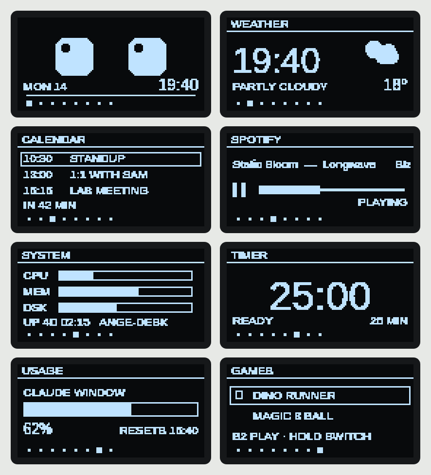
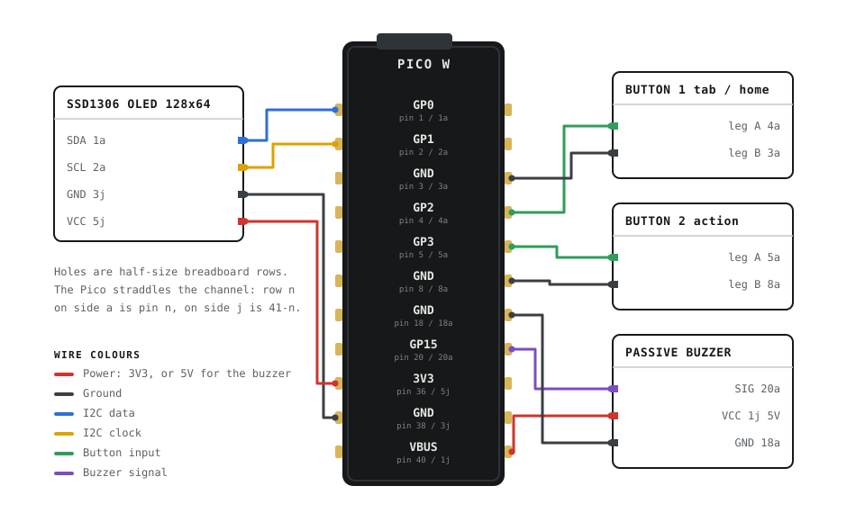

<p align="center">
  
</p>

<p align="center">
  A desk buddy that looks back.<br>
  A Raspberry Pi Pico W, a 128&times;64 OLED and two buttons.
</p>

<p align="center">
  
  
  
  
</p>

<p align="center">
  <a href="https://YOUR-USERNAME.github.io/mimic/"><b>Try the interface in your browser &rarr;</b></a>
</p>

---

Mimic sits next to the keyboard and keeps an eye on things. It knows the weather,
what is playing, how long until the next meeting, how hard the PC is working, and
how much of the Claude usage window is left — and it pulls a face about all of it.

Eight screens, two buttons, one buzzer. No touchscreen, no app, no cloud account
on the device.

<p align="center">
  
</p>

## Why this exists

Mimic started as a private project with two goals: learn electronics properly by
building something that has to work every day, and write Python outside the
analysis scripts I write for work — event loops, hardware constraints, a small
HTTP service, and code that has to survive being unplugged.

It is a learning project, not a product. Some of it is solved the long way round
because the long way round was the point. If you are building your own, the
troubleshooting section below is where most of the learning ended up.

## Contents

- [Why this exists](#why-this-exists)
- [The screens](#the-screens)
- [Bill of materials](#bill-of-materials)
- [Wiring](#wiring)
- [Getting it running](#getting-it-running)
- [The bridge](#the-bridge)
- [The case](#the-case)
- [Repository layout](#repository-layout)
- [Troubleshooting](#troubleshooting)
- [Roadmap](#roadmap)
- [License](#license)

## The screens

Button 1 walks through the tabs and jumps home when held. Button 2 does whatever
the current tab needs.

| Tab | What it shows | Button 2 |
| --- | --- | --- |
| `FACE` | Animated eyes: idle blinking, gaze drift, moods driven by weather and context | Cycles mood |
| `WEATHER` | Current conditions, today's range, and a clock big enough to read across the room | — |
| `CALENDAR` | The next few events from a private iCal feed | — |
| `SPOTIFY` | Current track and progress, via the Spotify Web API | Play / pause, hold to skip |
| `SYSTEM` | CPU, memory, disk and uptime of the PC beside it | — |
| `TIMER` | Countdown with three presets and a jingle on zero | Start / pause, hold to change preset |
| `USAGE` | How much of the current Claude usage window has been spent | — |
| `GAMES` | A menu holding the dino runner and a magic eight ball | Play, hold to switch game |

The two games live in `dino.py` and `eightball.py` and are imported lazily, the
first time you open one, so they cost nothing until they are used.

A meeting popup interrupts any tab when the next calendar event is close.

Burn-in protection runs underneath all of it: the whole frame shifts by a pixel
periodically and brightness drops at night. There is no idle sleep — an idle
timeout was tried and removed, because a desk buddy that blanks itself while you
are sitting right there is just a dark rectangle.

## Bill of materials

| Part | Notes |
| --- | --- |
| Raspberry Pi Pico W | Wi-Fi is 2.4 GHz only |
| SSD1306 OLED, 0.96", I2C | 128&times;64, monochrome — there is no colour anywhere in this project |
| 2 &times; tactile buttons | 6&times;6 mm switches on ~25.4 mm pre-assembled discs |
| Passive buzzer module | Plays arbitrary frequencies, so short melodies work |
| Half-size breadboard | Trim the top rail strip so it drops into the tray |
| Female-to-male Dupont jumpers | Nine connections, no soldering |
| USB cable and a 3D printer | For power, code and the case |

## Wiring

<p align="center">
  
</p>

| Signal | Pico W pin | Goes to |
| --- | --- | --- |
| I2C data | `GP0` — physical pin 1 | OLED `SDA` |
| I2C clock | `GP1` — physical pin 2 | OLED `SCL` |
| Ground | `GND` — physical pin 3 | OLED `GND` |
| 3V3 out | `3V3` — physical pin 36 | OLED `VCC`, buzzer `VCC` |
| Button 1 | `GP2` — physical pin 4 | Button 1 leg A (leg B to any `GND`) |
| Button 2 | `GP3` — physical pin 5 | Button 2 leg A (leg B to any `GND`) |
| Buzzer | `GP20` — physical pin 26 | Buzzer `SIG` |

Breadboard positions for this exact build are in
[`hardware/README.md`](hardware/README.md).

Check every connection against the table before powering anything up, and check
again after any work on the case. Most faults on this build were a connector
that had worked loose, not code.

## Getting it running

**1. Flash CircuitPython.** Hold `BOOTSEL` while plugging the Pico W in, then
drop the `.uf2` onto the `RPI-RP2` drive. It reboots as `CIRCUITPY`.

**2. Add the libraries.** From the matching CircuitPython bundle, copy into
`/lib` on `CIRCUITPY`:

```
adafruit_display_text/
adafruit_displayio_ssd1306.mpy
adafruit_connection_manager.mpy
adafruit_requests.mpy
```

**3. Add your settings.** Copy `settings.toml.example` to `settings.toml` on the
board and fill it in. `settings.toml` is gitignored; keep it that way.

```toml
CIRCUITPY_WIFI_SSID     = "your-network"
CIRCUITPY_WIFI_PASSWORD = "your-password"
BRIDGE_HOST             = "192.168.1.42"
CITY                    = "Athens"
```

**4. Deploy.**

```bash
cp code.py eyes.py dino.py eightball.py sfx.py icons.py \
   /media/$USER/CIRCUITPY/ && sync
tio /dev/ttyACM0    # watch it boot
```

Root of the drive, not `/lib`. The `&& sync` is not optional: without it the
drive can be unmounted mid-write and the board boots into a partially written
file.

**5. Start the bridge** on the PC Mimic lives next to — see below.

## The bridge

The Pico has no business holding Spotify tokens or a private calendar URL, so it
doesn't. `bridge/bridge.py` is a standard-library HTTP server that runs on the PC,
listens on port 8080, and hands back plain numbers. The Pico polls it.

`bridge/spotify.py` is both the one-time login (`python3 spotify.py`, which runs
the PKCE flow and stores the refresh token) and the module the bridge imports.
`bridge/cal_debug.py` exists only for troubleshooting the calendar feed.

Editing any of them leaves the old process running — restart the service after
every change.

| Endpoint | Returns |
| --- | --- |
| `GET /stats` | CPU load, memory, disk, uptime |
| `GET /next` | The next calendar event and its start time |
| `GET /now` | Spotify playback state and Claude usage percentage |

Spotify uses PKCE OAuth; the refresh token stays in the bridge's config file on
the PC. The calendar is read from the private iCal URL and parsed PC-side.

Install it as a user service so it comes back after a reboot:

```bash
mkdir -p ~/.config/systemd/user
cp bridge/mimic-bridge.service ~/.config/systemd/user/
systemctl --user enable --now mimic-bridge
systemctl --user status mimic-bridge
```

If the PC sleeps, Mimic falls back to its offline screens rather than hanging.

## The case

Five printed parts: three of mine, two from MakerWorld.

| Part | Source | What it does |
| --- | --- | --- |
| `tray.stl` | Custom, `hardware/case.scad` | Body: breadboard pocket, USB opening on the right wall, button shelf |
| `lid.stl` | Custom, `hardware/case.scad` | Lifts off on a locating lip, with a cable pass-through |
| `spacer.stl` | Custom, `hardware/case.scad` | Sets the stack height inside the tray so the openings line up |
| Screen stand | [Minimalist OLED 0.96" modular case](https://makerworld.com/en/models/2085334-minimalist-oled-0-96-modern-modular-cases#profileId-2253779) by Maker Engineer | Holds the OLED at a readable angle |
| Button assemblies | [Push button assembly](https://makerworld.com/en/models/1791039-push-button-assembly?from=search#profileId-1908757) by Leroyd | The two ~25.4 mm button discs |

Check each MakerWorld licence before reusing those two — most are Creative
Commons and ask for attribution, some forbid commercial use.

### Printing it

1. **Print the two downloaded parts first** with the settings on their model
   pages. They are quick, and they tell you whether your printer holds tolerance
   before you commit hours to the tray.
2. **Print the tray.** 0.2 mm layers, 15% infill, PLA, no supports, open side up.
   Check the breadboard pocket against your actual breadboard while a reprint is
   still cheap.
3. **Print the spacer and the lid.** Same settings.
4. **Clean the openings.** Clear elephant's foot from the counterbores and the
   USB slot with a craft knife until parts seat without force.
5. **Dry fit everything** before wiring: breadboard into the tray, spacer under
   the stack, buttons into the shelf, screen into its stand, cable through the
   slot.
6. **Assemble and re-test.** Seat the Dupont connectors dry and power it up
   before the lid goes on.

Exporting the custom parts:

```bash
openscad -D 'part="tray"'   -o hardware/stl/tray.stl   hardware/case.scad
openscad -D 'part="lid"'    -o hardware/stl/lid.stl    hardware/case.scad
openscad -D 'part="spacer"' -o hardware/stl/spacer.stl hardware/case.scad
```

**Do not glue the Dupont connectors.** Superglue wicks between the metal
contacts and insulates them: the joint looks perfect and conducts nothing. Two
attempts at custom button caps also failed here, both because the boss length
was measured from the wrong reference face — which is why the discs above are a
download rather than a design.

## Repository layout

```
mimic/
├── code.py                 # main loop and all eight screens
├── eyes.py                 # the face: moods, blinking, gaze, boot animation
├── dino.py                 # the runner, imported on first launch
├── eightball.py            # the magic eight ball, imported on first launch
├── sfx.py                  # the buzzer and its melody table
├── icons.py                # weather sprites
├── screenshot.py           # framebuffer dumper, see tools/shot.py
├── settings.toml.example   # Wi-Fi and bridge config template
├── bridge/
│   ├── bridge.py           # PC-side HTTP service, standard library only
│   ├── spotify.py          # one-time PKCE login, and the bridge's module
│   ├── cal_debug.py        # calendar feed troubleshooting
│   └── mimic-bridge.service
├── hardware/
│   ├── case.scad           # tray, lid and spacer
│   ├── stl/
│   └── README.md
├── docs/                   # the GitHub Pages site
│   ├── index.html          # one file, includes the browser simulator
│   └── assets/             # logo, favicons, wiring map, social preview
└── tools/                  # shot.py and the asset generators
```

Before the first push, replace `YOUR-USERNAME` in this file and in
`docs/index.html`.

## Troubleshooting

**The board boots to an error after a deploy.** The write did not flush. Copy
again with `&& sync` and watch the console with `tio /dev/ttyACM0`.

**It will not join the network.** The Pico W radio is 2.4 GHz only. A combined
2.4/5 GHz SSID sometimes works and sometimes does not; give the 2.4 GHz band its
own name if you can.

**No serial device on Linux.** Add yourself to `dialout` and log back in, then
stop ModemManager grabbing the port:

```bash
sudo usermod -aG dialout $USER
sudo systemctl mask ModemManager
```

**A button stopped responding after assembly.** Check for glue before checking
the code. Superglue wicks between Dupont contacts and insulates them perfectly.
Wiggle the connector to crack the joint, re-seat it dry, and let the pinched
barrel do the gripping.

**Python tooling refuses to install.** Check whether conda is shadowing the
system Python with an older version, and point `pipx` at the real one, for
example `/usr/bin/python3.12`.

**The screen shows stale numbers.** The bridge is not running, or the PC is
asleep. `systemctl --user status mimic-bridge`.

## Roadmap

- [ ] Face reacts to more context: happy while music plays, tired when uptime is long, worried as the usage window fills
- [ ] Top-mounted screen holder integrated into the tray, replacing the separate stand
- [ ] A task button that cycles today's tasks and marks them done

Dropped on purpose: Gmail notifications (too much moving parts for the payoff)
and anything that depends on colour.

## License

MIT — see [LICENSE](LICENSE).

Built with [CircuitPython](https://circuitpython.org/), Adafruit's display
libraries, and [OpenSCAD](https://openscad.org/). The screen stand and button
discs are other people's models — see [The case](#the-case) for links and
licences.

The logo, the wiring diagram, the social image and the project site were made
with help from Claude (Anthropic). The hardware, the code and the mistakes are
mine.
